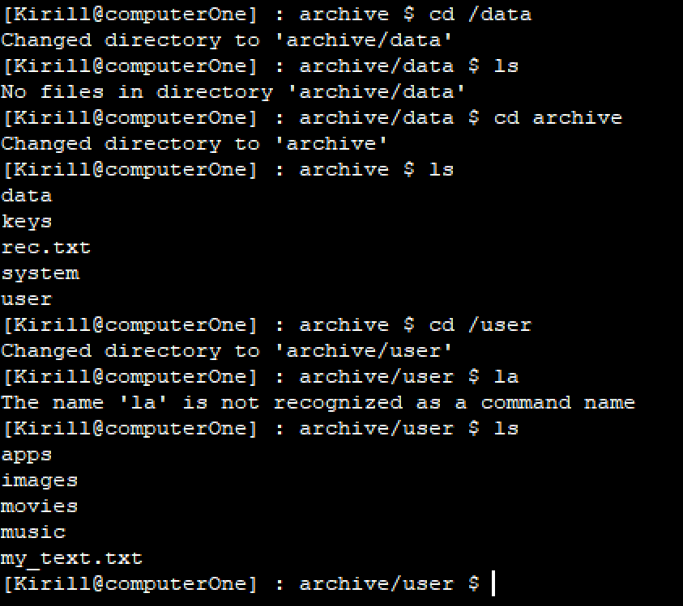
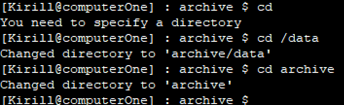
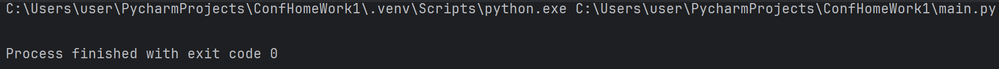
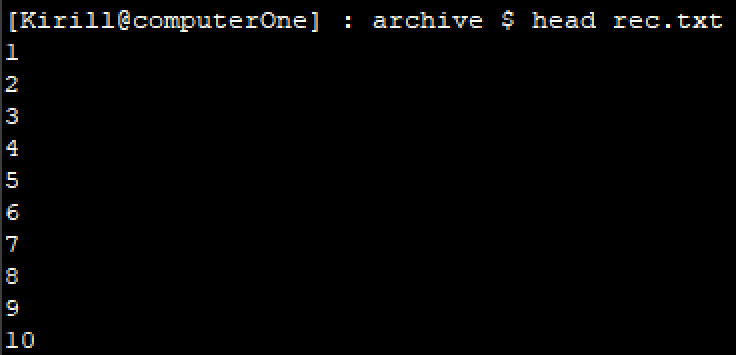
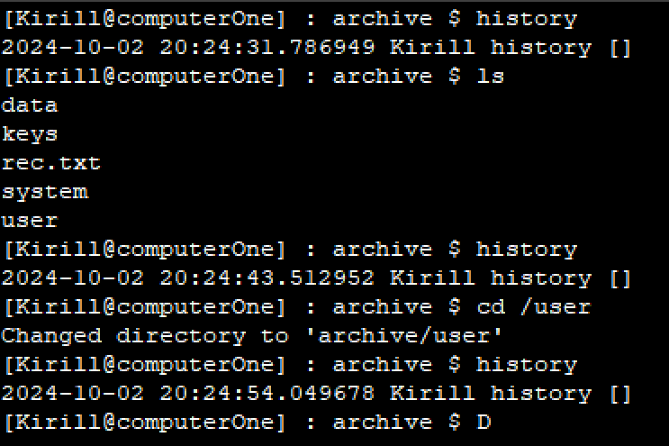

## Задание 
Разработать эмулятор для языка оболочки ОС. Необходимо сделать работу
эмулятора как можно более похожей на сеанс shell в UNIX-подобной ОС.
Эмулятор должен запускаться из реальной командной строки, а файл с
виртуальной файловой системой не нужно распаковывать у пользователя.
Эмулятор принимает образ виртуальной файловой системы в виде файла формата
zip. Эмулятор должен работать в режиме GUI.
Конфигурационный файл имеет формат yaml и содержит:
• Имя пользователя для показа в приглашении к вводу.
• Имя компьютера для показа в приглашении к вводу.
• Путь к архиву виртуальной файловой системы.
Необходимо поддержать в эмуляторе команды ls, cd и exit, а также
следующие команды:
1. head.
2. history.
Все функции эмулятора должны быть покрыты тестами, а для каждой из
поддерживаемых команд необходимо написать 3 теста
## Тесты:
Команда ls:

Команда cd:

Команда exit:

Команда head:

Команда history:

